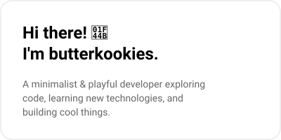
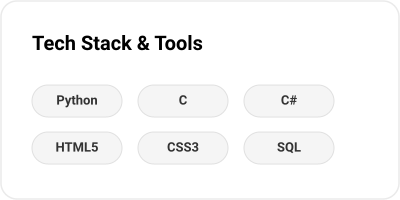
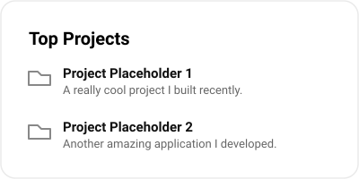

 

<!-- BENTO BOX GRID -->
<table>
  <tr>
    <td align="center" valign="top">
      
    </td>
    <td align="center" valign="top">
      <a href="https://github.com/butterkookies">
        <picture>
          <source media="(prefers-color-scheme: dark)" srcset="https://github-readme-stats.vercel.app/api?username=butterkookies&show_icons=true&bg_color=0a0a0a&title_color=ffffff&text_color=a0a0a0&icon_color=ffffff&border_color=333333&border_radius=16">
          <source media="(prefers-color-scheme: light)" srcset="https://github-readme-stats.vercel.app/api?username=butterkookies&show_icons=true&bg_color=ffffff&title_color=000000&text_color=333333&icon_color=000000&border_color=eaeaea&border_radius=16">
          
        </picture>
      </a>
    </td>
  </tr>
  <tr>
    <td align="center" valign="top">
      
    </td>
    <td align="center" valign="top">
      <a href="https://github.com/butterkookies">
        <picture>
          <source media="(prefers-color-scheme: dark)" srcset="https://github-readme-streak-stats.herokuapp.com/?user=butterkookies&background=0a0a0a&ring=ffffff&fire=ffffff&currStreakNum=ffffff&currStreakLabel=a0a0a0&sideNums=ffffff&sideLabels=a0a0a0&dates=a0a0a0&border=333333&borderRadius=16">
          <source media="(prefers-color-scheme: light)" srcset="https://github-readme-streak-stats.herokuapp.com/?user=butterkookies&background=ffffff&ring=000000&fire=000000&currStreakNum=000000&currStreakLabel=333333&sideNums=000000&sideLabels=333333&dates=333333&border=eaeaea&borderRadius=16">
          
        </picture>
      </a>
    </td>
  </tr>
  <tr>
    <td align="center" valign="top">
      
    </td>
    <td align="center" valign="top">
      
        
      <!-- Spotify Now Playing Placeholder -->
      <a href="https://spotify.com">
        <picture>
          <source media="(prefers-color-scheme: dark)" srcset="https://novatorem.vercel.app/api/spotify?bg_color=0a0a0a&title_color=ffffff&text_color=a0a0a0&icon_color=ffffff&border_color=333333&border_radius=16">
          <source media="(prefers-color-scheme: light)" srcset="https://novatorem.vercel.app/api/spotify?bg_color=ffffff&title_color=000000&text_color=333333&icon_color=000000&border_color=eaeaea&border_radius=16">
          
        </picture>
      </a>
    </td>
  </tr>
</table>

