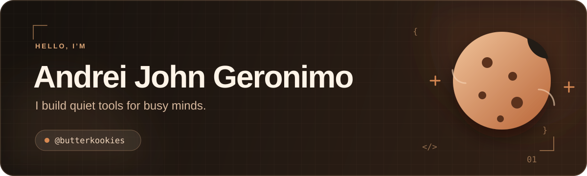

<div align="center">
  
</div>

<p align="center">
  <a href="https://github.com/butterkookies?tab=followers"></a>
  <a href="https://github.com/butterkookies?tab=repositories"></a>
</p>

I’m **Andrei**, a developer who enjoys turning ambitious ideas into focused, tactile software. I care about local-first experiences, thoughtful interfaces, and tools that stay out of the user’s way.

Right now I’m building **CiaNotes** — an offline-first native notebook with handwriting, rich text, source-backed PDF editing, and a custom portable file format for my girlfriend. It is where I explore the seam between polished React interfaces and systems work in Rust.

```text
current focus  →  desktop apps · local-first software · calm interfaces
learning loop  →  build it · break it · understand it · make it feel simple
small belief   →  good tools should give attention back, not ask for more
```

## Things I’ve built

| Project | What it is | Built with |
| :--- | :--- | :--- |
| [**do.**](https://github.com/butterkookies/Do-CLI) · [live app](https://do-cli.vercel.app) | A keyboard-first task manager with a CLI aesthetic and GitHub-style activity heatmap. | Next.js · TypeScript · Supabase |
| [**TrimOS**](https://github.com/butterkookies/TrimOS) | A terminal-based Windows optimizer with live performance graphs, service profiles, and reversible snapshots. | Python · Textual · psutil |
| [**SecondBrain**](https://github.com/butterkookies/SecondBrain) | A personal knowledge system for capturing, organizing, and resurfacing notes and ideas. | Python |
| [**Taurus Bike Shop**](https://github.com/butterkookies/OOP-TaurusBikeShop) | A full e-commerce and admin system built as an OOP and database capstone. | C# · T-SQL · HTML/CSS |

## My workbench

<p align="left">
  
  <br />
  
</p>

## A little signal in the noise

<div align="center">
  
  
</div>

<picture>
  <source media="(prefers-color-scheme: dark)" srcset="https://raw.githubusercontent.com/butterkookies/butterkookies/output/github-contribution-grid-snake-dark.svg" />
  <source media="(prefers-color-scheme: light)" srcset="https://raw.githubusercontent.com/butterkookies/butterkookies/output/github-contribution-grid-snake.svg" />
  
</picture>

<div align="center">
  <sub>Thanks for stopping by. If something here sparks an idea, open an issue or say hello through GitHub.</sub>
</div>
